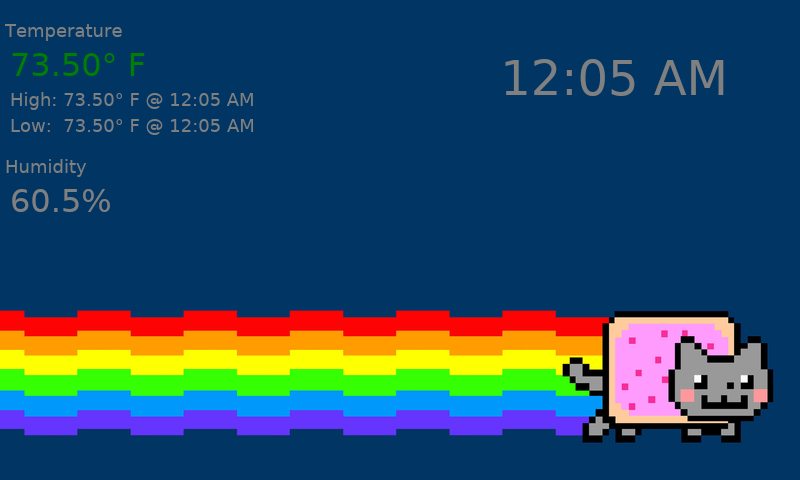

# pidashboard
Displays temperature, humidity and time.
Requires [pitempd](https://github.com/mapitman/pitempd) to be running on the same system.

This was written to run on a Raspberry Pi using the raw framebuffer device. 

